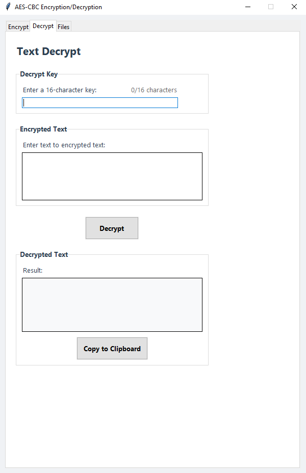
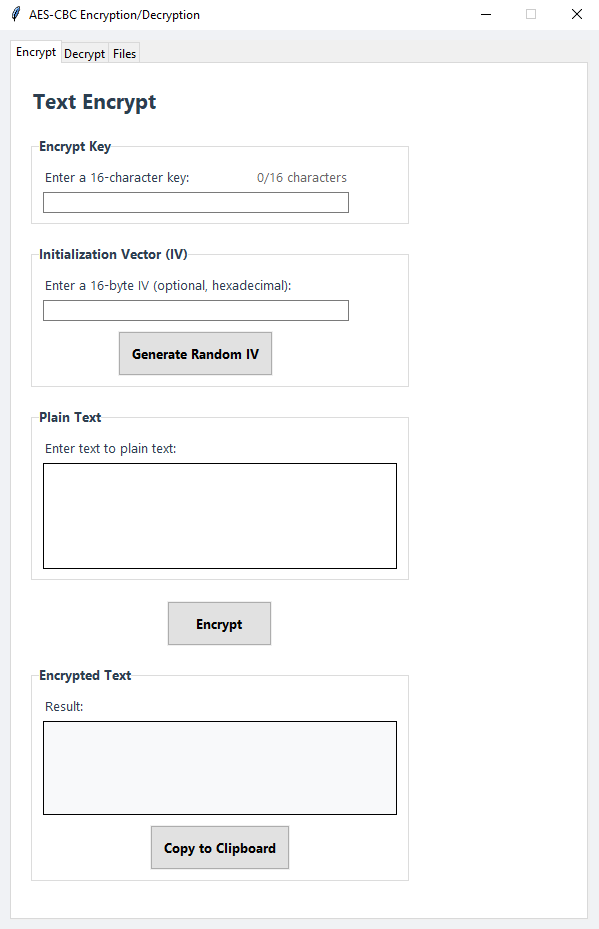
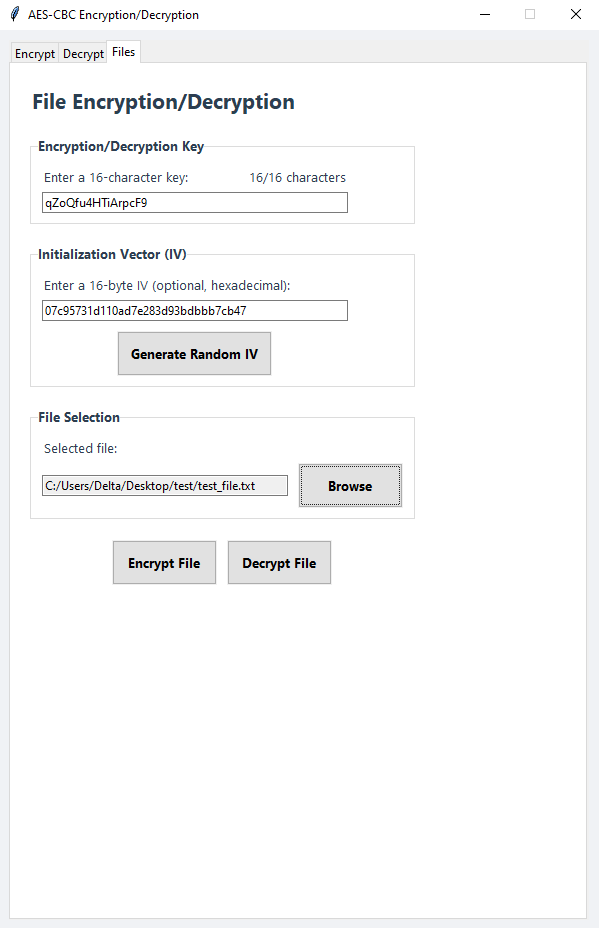
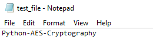
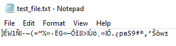
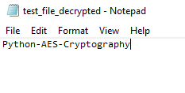

# Python-AES-Cryptography

A Python-based tool for AES-CBC encryption and decryption with a modern GUI interface.

## 🛠️ Tech Stack
* **Python 3**
* `tkinter` - for the GUI
* `os` - for system operations
* Custom AES implementation

## 💡 Main Features
* AES-128 encryption with CBC mode
* Text and file encryption/decryption
* Modern user interface with tabbed design
* Support for custom initialization vectors (IV)
* File system integration

## Usage

### Text Encryption
Enter your secret 16-character key, optionally specify an IV (or generate a random one), input your plain text, and encrypt it with a single click.

### Text Decryption
Enter the same 16-character key that was used for encryption, paste the encrypted text, and decrypt to recover the original message.

### File Operations
Encrypt any file on your system using a key and IV. The encrypted file will be saved with an ".encrypted" extension. Decrypt previously encrypted files to recover the original content.

## Setup
> 1. Clone the repository
> 2. Ensure Python 3.7+ is installed
> 3. Run `python gui.py`

## Screenshots

  
Click to expand screenshots

  
  ### Application Interface
  
  #### Text Decryption Tab
  
  
  #### Text Encryption Tab
  
  
  ### File Encryption Example
  
  #### Step 1: Configure Encryption Settings
  
  
  Enter a 16-character key and either enter an IV or generate a random one. Select your target file for encryption.
  
  #### Step 2: Original File Before Encryption
  
  
  The original text file contains readable content: "Python-AES-Cryptography".
  
  #### Step 3: Encrypted File Content
  
  
  After encryption, the file content becomes unreadable encrypted data.
  
  #### Step 4: Decrypted File Result
  
  
  After decryption using the same key and IV, the original content is restored: "Python-AES-Cryptography".
  

